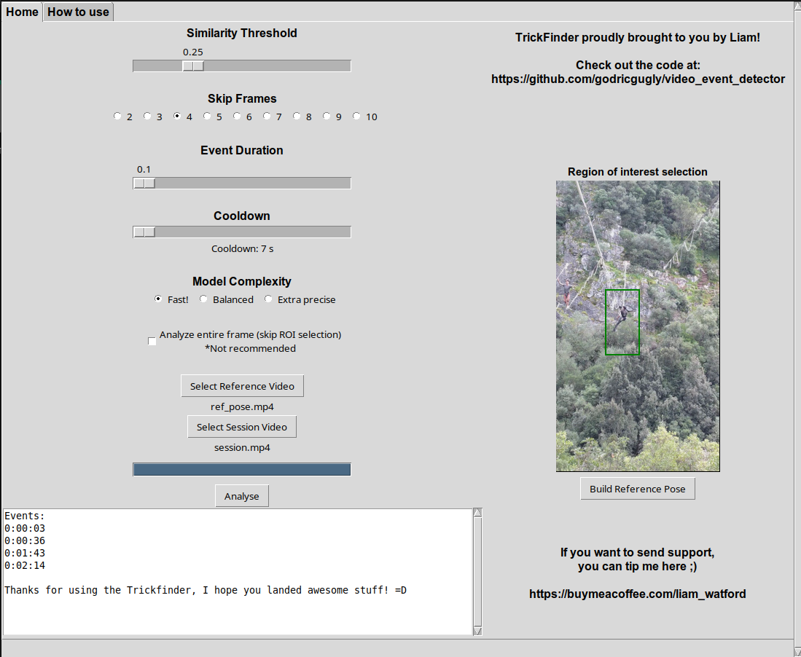

# TrickFinder  
### Video Event Detection Using Pose Similarity (Offline)

TrickFinder is an **offline computer vision tool** that detects when a reference pose appears in a video and returns timestamps.

It uses **MediaPipe pose estimation** and lightweight similarity matching to analyze movement in sports, tricks, and training footage.

---

## Features

- Detects matching poses in video sequences
- Uses 33-point MediaPipe pose landmarks
- Fast CPU-based processing (no GPU required)
- Fully offline (no API or cloud dependency)
- Temporal smoothing for stable detection
- Modular and extensible pipeline

---

## How It Works

1. Extract pose landmarks (MediaPipe)
2. Normalize pose (scale + translation invariance)
3. Build reference pose from a short clip
4. Compare each frame against reference
5. Apply similarity threshold + cooldown filtering
6. Output match timestamps

---

## Getting Started

### Release for non technical audience

Check the Releases for terminal-free usage (No need to download python or pip either)

### Prerequisites

- Python 3.10+
- pip

### Installation

-> Bash:
git clone https://github.com/godricgugly/video_event_detector.git
cd video_event_detector
source .venv/bin/activate
pip install -r requirements.txt

### Usage

activate virtual environment!
-> Bash
source .venv/bin/activate

UI:
python run.py

No UI:
python src/app/main.py

*for this you must populate:
    data/references/ref_pose.mp4
    data/raw/session.mp4

### tests

-> Bash
pytest

Covers:

-normalization
-similarity
-event detection
-video loading
-reference building

### Configuration:

You may need to tune parameters depending on your footage:

Similarity threshold
Frame skip rate
Detection cooldown window

## Design goals

Offline first
No training required
Fast CPU execution
Modular pipeline
Temporal smoothing for stability

## Stack

Python 3.10+
MediaPipe
OpenCV
NumPy
Tkinter
pytest

## Screenshot

